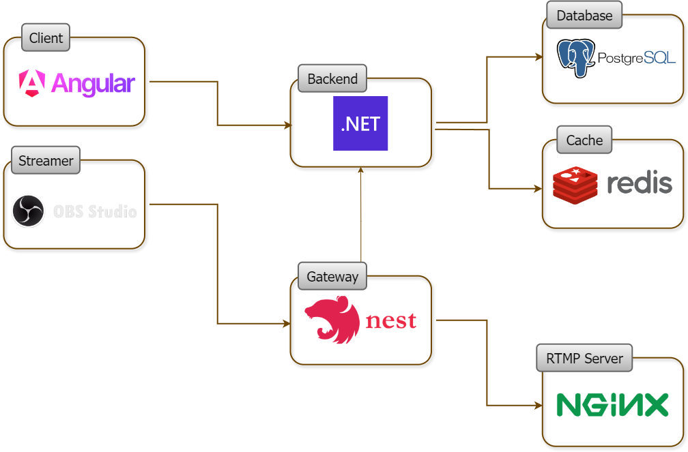

<!-- @format -->

# Streaming App

Streaming App is a live streaming application like Twitch.

## Table of Contents

- [Features](#features)
- [Architecture Diagram](#architecture-diagram)

## Features

Streaming App includes the following features:

- **Live streaming:** Users can live stream by using their "stream key" via OBS.

- **Stream chat:** Stream chat is available when streamer is online or offline.

- **Following streamers:** Users can follow streamers.

- **Recommended streamers:** Users will get recommendations based on the current live streamers and the streamers they follow.

- **Uploading profile or stream pictures:** Users can upload pictures for their profiles or their stream thumbnails.

- **Stream Moderators:** Users can assign other users as a moderator of their stream with the operations they want.

- **Blocking users from stream:** Users can be blocked-unblocked from a stream by streamer or moderators.

- **Chat Options:** Streamers or authorized moderators can make changes about the stream options. Options includes: Chat delay second, must be follower to use chat, enable or disable chat.

- **Real-time notifications:** Users will receive real-time notifications when in stream chat, when stream is started or ended, chat options changed, when blocked or unblocked from stream, when assigned as moderator or removed from moderators.

## Architecture Diagram

